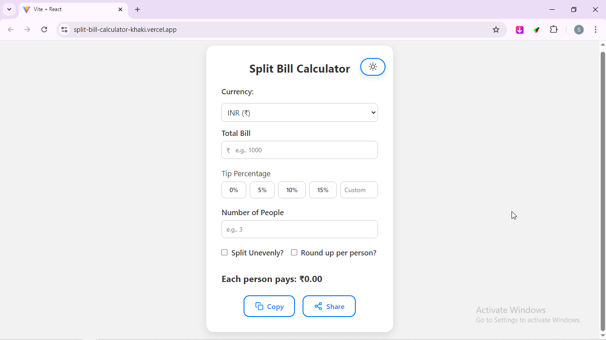
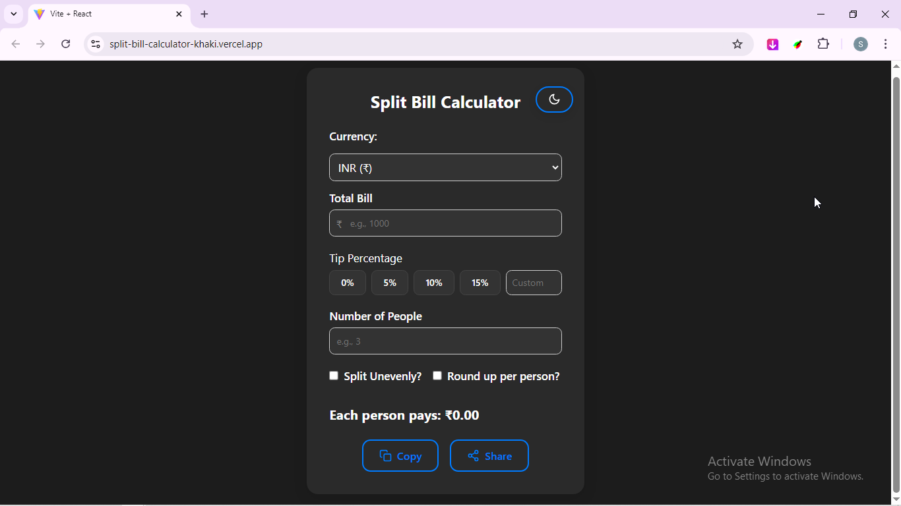

# 📜 Split Bill Calculator

A responsive and user-friendly bill-splitting application built using **ReactJS** and **Styled Components**. This app lets you quickly calculate how much each person should pay — with support for tip percentages, uneven splits, rounding, currency selection, and more.

---

## 🔗 Live Demo

👉 [Click here to view live](https://split-bill-calculator-khaki.vercel.app/)

---

## 📦 Tech Stack

- ⚛️ React (Vite + Functional Components)
- 💅 Styled Components
- 🧮 JavaScript
- 🎨 Responsive Design

---

## 🎯 Features

### ✅ Core Features
- Enter total bill, tip %, and number of people
- Real-time per person amount calculation
- Responsive on all screen sizes
- Input validation (no zero or negative entries)

### 🌟 Bonus Features
- 💸 **Uneven Split**: Custom amount per person
- 🌐 **Currency Selector**: ₹, $, €, £
- 🌗 **Dark/Light Mode Toggle**
- 🧮 **Round-Up Option** per person
- 📤 **Copy or Share** results

---

## 🖥️ Screenshots

| Light Mode                        | Dark Mode                        |
|----------------------------------|----------------------------------|
|  |  |

---

## ⚙️ Getting Started

### 1. Clone the repo
```bash
git clone https://github.com/swadeshChhetri/SplitBillCalculator.git
cd split-bill-calculator
